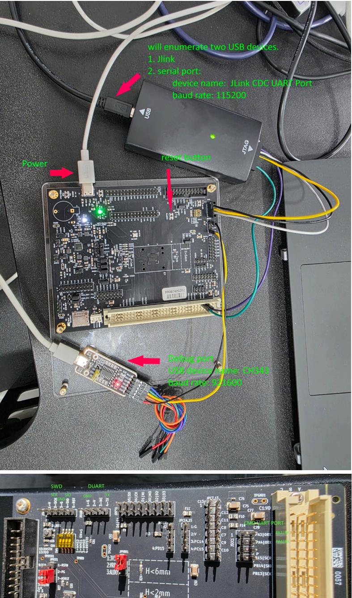

# Software Development Guide

This guide provides an overview of the Daric Evaluation Board (EVB) and outlines the essential steps for firmware development.

## Part 1: Hardware Setup and Toolchain Configuration

### 1. Hardware Connections

The Daric EVB requires the following connections for proper operation:
- **Power Supply**: Connect a Type-C cable to the designated power interface.
- **SWD Debug Interface**: Use a J-Link or DAPLink debugger to connect to the SWD pins (SWDIO, SWCLK, GND) for flashing and debugging.
- **Log Output (Serial)**: Connect the board's designated log serial port to a PC to monitor system output.
- **CLI Interaction (Serial)**: Connect the command-line interface (CLI) serial port (if supported) for interactive debugging.

  

### 2. Development Toolchain Installation

The Daric EVB platform supports development on **Windows, Linux, and macOS**. Ensure the following tools are installed and available in your system's `PATH`:

- **Cross-Compiler**: `arm-none-eabi-gcc` (Version 14.3 recommended).
    - [Download from Arm GNU Toolchain](https://developer.arm.com/downloads/-/arm-gnu-toolchain-downloads)
- **CMake**: Build system generator.
    - Installation: `sudo apt install cmake` (Linux) or `brew install cmake` (macOS).
- **Ninja**: High-performance build tool.
    - Installation: `sudo apt install ninja-build` (Linux) or `brew install ninja` (macOS).

### 3. Compilation Procedure

A streamlined build script is provided for ease of use. To compile the project:

1. Open a terminal and navigate to the project root (the parent directory of `projects/evb_nto/bare_metal/uart_demo`).
2. Execute the build script for the `uart_demo`:

__Keil MDK:__
```cmd
cd projects\evb_nto\bare_metal\uart_demo\MDK-ARM
build.bat
C:\msys64\home\robin\workspace\daric_opensource\projects\evb_nto\bare_metal\uart_demo\MDK-ARM>build_mdk.bat
[INFO] Building uart_demo.uvprojx...
This process may take a while. Output is being logged to build_output.log.
*** Using Compiler 'V6.22', folder: 'C:\Users\robin\AppData\Local\Keil_v5\ARM\ARMCLANG\Bin'
Build target 'uart_demo'
compiling main.c...
compiling tg28.c...
compiling syscalls.c...
compiling daric_hal.c...
compiling daric_ifram.c...
compiling daric_hal_nvic.c...
compiling daric_hal_pinmap.c...
compiling daric_hal_gpio.c...
compiling daric_hal_atimer.c...
compiling daric_tlsf.c...
compiling daric_hal_i2c.c...
compiling daric_hal_uart.c...
compiling startup_daric.c...
compiling system_daric.c...
linking...
Program Size: Code=26356 RO-data=5660 RW-data=1840 ZI-data=98984
After Build - User command #1: .\cmd.bat
Directory does not exist. Creating it...
Directory created successfully.
已复制         1 个文件。
".\Objects\uart_demo.axf" - 0 Error(s), 0 Warning(s).
Build Time Elapsed:  00:00:07
----------------------------------------------------------------------
[SUCCESS] Build Successful! (0 Errors, 0 Warnings)
----------------------------------------------------------------------

C:\msys64\home\robin\workspace\daric_opensource\projects\evb_nto\bare_metal\uart_demo\MDK-ARM>dir bin
 驱动器 C 中的卷是 Windows
 卷的序列号是 B8FB-275A

 C:\msys64\home\robin\workspace\daric_opensource\projects\evb_nto\bare_metal\uart_demo\MDK-ARM\bin 的目录

2026/03/25  14:05    <DIR>          .
2026/03/25  14:05    <DIR>          ..
2026/03/25  14:05           787,187 uart_demo.asm
2026/03/25  14:05            32,068 uart_demo.bin
2026/03/25  14:05           419,969 uart_demo.map
               3 个文件      1,239,224 字节
               2 个目录 50,452,951,040 可用字节
```

Upon completion, the firmware files (`uart_demo.bin`) will be located in:
`projects\evb_nto\bare_metal\uart_demo\MDK-ARM\bin\`

__GNU GCC:__
```bash
robin@rwan-t14 MINGW64 /c/msys64/home/robin/workspace/daric_opensource/projects/evb_nto/bare_metal/uart_demo/GCC (master)
$ ./scripts/build.sh -c
Output dir set to scripts/../out
Build type set to Debug
Log level set to STATUS
Extra CMake args:
Clean build enabled. Deleting output directory...
cmake -G Ninja -B scripts/../out -DCMAKE_BUILD_TYPE=Debug scripts/cmake --log-level=STATUS
-- ARM_COMPILER_PATH @
-- ARM_COMPILER_PATH @
-- The C compiler identification is GNU 13.3.1
-- The ASM compiler identification is GNU
-- Found assembler: C:/Program Files (x86)/Arm GNU Toolchain arm-none-eabi/13.3 rel1/bin/arm-none-eabi-gcc.exe
-- Detecting C compiler ABI info
-- Detecting C compiler ABI info - done
-- Check for working C compiler: C:/Program Files (x86)/Arm GNU Toolchain arm-none-eabi/13.3 rel1/bin/arm-none-eabi-gcc.exe - skipped
-- Detecting C compile features
-- Detecting C compile features - done
-- Configuring done (1.8s)
-- Generating done (0.1s)
-- Build files have been written to: C:/msys64/home/robin/workspace/daric_opensource/projects/evb_nto/bare_metal/uart_demo/GCC/out
ninja: Entering directory `scripts/../out'
[15/16] Linking C executable uart_demo.elf
Memory region         Used Size  Region Size  %age Used
           RERAM:       33428 B      3816 KB      0.86%
            SRAM:        992 KB         2 MB     48.44%
            ITCM:           4 B       256 KB      0.00%
            DTCM:           0 B        64 KB      0.00%
           IFRAM:           0 B       256 KB      0.00%
           AORAM:         256 B        16 KB      1.56%
[16/16] C:\WINDOWS\system32\cmd.exe /C "cd /D C:\msys64\home\robin\workspace\daric_opensource\projects\...rm GNU Toolchain arm-none-eabi\13.3 rel1\bin\arm-none-eabi-objdump.exe" -S uart_demo.elf > uart_demo.S"

robin@rwan-t14 MINGW64 /c/msys64/home/robin/workspace/daric_opensource/projects/evb_nto/bare_metal/uart_demo/GCC (master)
$ ls out/
build.ninja  cmake_install.cmake  CMakeCache.txt  CMakeFiles/  compile_commands.json  uart_demo.bin  uart_demo.elf  uart_demo.hex  uart_demo.map  uart_demo.S
```

> [!NOTE]
> The `-c` flag performs a clean build, removing existing artifacts before recompilation.

Upon completion, the firmware files (`uart_demo.bin` and `uart_demo.elf`) will be located in:
`projects/evb_nto/bare_metal/uart_demo/GCC/out/`

> [!NOTE]
> Actually the latest version of both build scripts are located at `utilities/build/`, you can copy them or create a link to them in your project directory if needed.
```bash
robin@rwan-t14 MSYS ~/workspace/daric_opensource/utilities/build
$ ls
build_gcc.sh  build_mdk.bat  cmd.bat
```

### 4. J-Link Flash Algorithm Configuration

For standard debugging and flashing via SWD, the Daric Flash algorithm `daric_reram.FLM` and Daric device denifition xml `JLinkDevices.xml` must be used together with the J-Link debugger:
> [!NOTE]
> Please use V7.92h or above version of J-Link debugger driver.

Both of these two files are located at `utilities/flash/ in Linux or utilities\flash\ in Windows`.
```bash
robin@rwan-t14 MSYS ~/workspace/daric_opensource/utilities/flash
$ ls
daric_reram.FLM  flash_gcc.sh  flash_mdk.bat  JLinkDevices.xml
```

### 5. Flashing Application Firmware

To deploy the compiled application (e.g., `uart_demo.bin`), you can use J-Flash Lite which has GUI, or use flash scripts both in Linux and Windows.

The scripts are located at `utilities/flash/` in Linux or `utilities\flash\` in Windows, `flash_mdk.bat` for MDK and `flash_gcc.sh` for GCC.

```bash
robin@rwan-t14 MSYS ~/workspace/daric_opensource/utilities/flash
$ ls
daric_reram.FLM  flash_gcc.sh  flash_mdk.bat  JLinkDevices.xml
```

#### Flash application firmware using `flash_mdk.bat`

```bash
robin@rwan-t14 MSYS ~/workspace/daric_opensource/utilities/flash
$ ./flash_mdk.bat ~/workspace/daric_opensource/projects/evb_nto/bare_metal/uart_demo/MDK-ARM/bin/uart_demo.bin 0x60020000
[INFO] Generating J-Link Script...
[INFO] Flashing firmware to DARIC_NTO at 0x60020000 using J-Link V7.x...
SEGGER J-Link Commander V7.92h (Compiled Oct  4 2023 16:23:14)
DLL version V7.92h, compiled Oct  4 2023 16:21:28


J-Link Command File read successfully.
Processing script file...
J-Link>Exec JLinkDevicesXMLPath="C:\msys64\home\robin\workspace\daric_opensource\utilities\flash\JLinkDevices.xml"
J-Link>device DARIC_NTO
J-Link connection not established yet but required for command.
Connecting to J-Link via USB...O.K.
Firmware: J-Link V9 compiled May  7 2021 16:26:12
Hardware version: V9.40
J-Link uptime (since boot): N/A (Not supported by this model)
S/N: 69405837
License(s): RDI, GDB, FlashDL, FlashBP, JFlash
VTref=3.274V
J-Link>si SWD
Selecting SWD as current target interface.
J-Link>speed 6000
Selecting 6000 kHz as target interface speed
J-Link>connect
Device "DARIC_NTO" selected.


Connecting to target via SWD
Found SW-DP with ID 0x0BD11477
DPIDR: 0x0BD11477
CoreSight SoC-400 or earlier
Scanning AP map to find all available APs
AP[1]: Stopped AP scan as end of AP map has been reached
AP[0]: AHB-AP (IDR: 0x04770041)
Iterating through AP map to find AHB-AP to use
AP[0]: Core found
AP[0]: AHB-AP ROM base: 0xE00FD000
CPUID register: 0x411FC272. Implementer code: 0x41 (ARM)
Cache: L1 I/D-cache present
Found Cortex-M7 r1p2, Little endian.
FPUnit: 4 code (BP) slots and 0 literal slots
CoreSight components:
ROMTbl[0] @ E00FD000
[0][0]: E00FE000 CID B105100D PID 000BB4C8 ROM Table
ROMTbl[1] @ E00FE000
[1][0]: E00FF000 CID B105100D PID 000BB4C7 ROM Table
ROMTbl[2] @ E00FF000
[2][0]: E000E000 CID B105E00D PID 000BB00C SCS-M7
[2][1]: E0001000 CID B105E00D PID 000BB002 DWT
[2][2]: E0002000 CID B105E00D PID 000BB00E FPB-M7
[0][1]: E0040000 CID 00000000 PID 00000000 ???
I-Cache L1: 16 KB, 256 Sets, 32 Bytes/Line, 2-Way
D-Cache L1: 16 KB, 128 Sets, 32 Bytes/Line, 4-Way
Memory zones:
  Zone: "Default" Description: Default access mode
Cortex-M7 identified.
J-Link>exec SetCompareMode=0
J-Link>loadfile "C:/msys64/home/robin/workspace/daric_opensource/projects/evb_nto/bare_metal/uart_demo/MDK-ARM/bin/uart_demo.bin", 0x60020000
'loadfile': Performing implicit reset & halt of MCU.
Reset: Halt core after reset via DEMCR.VC_CORERESET.
Reset: Reset device via AIRCR.SYSRESETREQ.
Reset: CPU may have not been reset (DHCSR.S_RESET_ST never gets set).
Reset: Using fallback: Reset pin.
Reset: Halt core after reset via DEMCR.VC_CORERESET.
Reset: Reset device via reset pin
Downloading file [C:/msys64/home/robin/workspace/daric_opensource/projects/evb_nto/bare_metal/uart_demo/MDK-ARM/bin/uart_demo.bin]...
J-Link: Flash download: Bank 0 @ 0x60000000: 1 range affected (131072 bytes)
J-Link: Flash download: Total: 1.814s (Prepare: 0.322s, Erase: 0.238s, Program: 0.287s, Verify: 0.920s, Restore: 0.046s)
J-Link: Flash download: Program speed: 445 KB/s
O.K.
J-Link>r
Reset delay: 0 ms
Reset type NORMAL: Resets core & peripherals via SYSRESETREQ & VECTRESET bit.
Reset: Halt core after reset via DEMCR.VC_CORERESET.
Reset: Reset device via AIRCR.SYSRESETREQ.
Reset: CPU may have not been reset (DHCSR.S_RESET_ST never gets set).
Reset: Using fallback: Reset pin.
Reset: Halt core after reset via DEMCR.VC_CORERESET.
Reset: Reset device via reset pin
J-Link>g
Memory map 'after startup completion point' is active
J-Link>exit

Script processing completed.

[INFO] Flashing Process Finished.
```

#### Flash application firmware using `jlink_flash_daric.sh`

```bash
robin@rwan-t14 MSYS ~/workspace/daric_opensource/utilities/flash
$ ./jlink_flash_daric.sh ~/workspace/daric_opensource/projects/evb_nto/bare_metal/uart_demo/GCC//out/uart_demo.bin 0x60020000
==========================================
JLink Firmware Download for Daric
==========================================
Binary File  : /home/robin/workspace/daric_opensource/projects/evb_nto/bare_metal/uart_demo/GCC/out/uart_demo.bin
Flash Address: 0x60020000
Device       : DARIC_NTO
JLink Version: V7.92
==========================================
[INFO] Generating JLink Script...
[INFO] Flashing firmware to DARIC_NTO at 0x60020000...
SEGGER J-Link Commander V7.92h (Compiled Oct  4 2023 16:23:14)
DLL version V7.92h, compiled Oct  4 2023 16:21:28


J-Link Command File read successfully.
Processing script file...
J-Link>Exec JLinkDevicesXMLPath="C:\msys64\home\robin\workspace\daric_opensource\utilities\flash\JLinkDevices.xml"
J-Link>ConnectUnderReset
Unknown command. '?' for help.
J-Link>connect
J-Link connection not established yet but required for command.
Connecting to J-Link via USB...O.K.
Firmware: J-Link V9 compiled May  7 2021 16:26:12
Hardware version: V9.40
J-Link uptime (since boot): N/A (Not supported by this model)
S/N: 69405837
License(s): RDI, GDB, FlashDL, FlashBP, JFlash
VTref=3.274V
Device "DARIC_NTO" selected.


Connecting to target via SWD
Found SW-DP with ID 0x0BD11477
DPIDR: 0x0BD11477
CoreSight SoC-400 or earlier
Scanning AP map to find all available APs
AP[1]: Stopped AP scan as end of AP map has been reached
AP[0]: AHB-AP (IDR: 0x04770041)
Iterating through AP map to find AHB-AP to use
AP[0]: Core found
AP[0]: AHB-AP ROM base: 0xE00FD000
CPUID register: 0x411FC272. Implementer code: 0x41 (ARM)
Cache: L1 I/D-cache present
Found Cortex-M7 r1p2, Little endian.
FPUnit: 4 code (BP) slots and 0 literal slots
CoreSight components:
ROMTbl[0] @ E00FD000
[0][0]: E00FE000 CID B105100D PID 000BB4C8 ROM Table
ROMTbl[1] @ E00FE000
[1][0]: E00FF000 CID B105100D PID 000BB4C7 ROM Table
ROMTbl[2] @ E00FF000
[2][0]: E000E000 CID B105E00D PID 000BB00C SCS-M7
[2][1]: E0001000 CID B105E00D PID 000BB002 DWT
[2][2]: E0002000 CID B105E00D PID 000BB00E FPB-M7
[0][1]: E0040000 CID 00000000 PID 00000000 ???
I-Cache L1: 16 KB, 256 Sets, 32 Bytes/Line, 2-Way
D-Cache L1: 16 KB, 128 Sets, 32 Bytes/Line, 4-Way
Memory zones:
  Zone: "Default" Description: Default access mode
Cortex-M7 identified.
J-Link>halt
PC = 60023022, CycleCnt = 0DAF5253
R0 = A6BB80F9, R1 = 05D2F644, R2 = 61000E40, R3 = 00000001
R4 = 8D02D285, R5 = 045B6BFB, R6 = 00001020, R7 = 0013DE18
R8 = 00000000, R9 = 61000B84, R10= 60027BE4, R11= 60027BE4
R12= 40040098
SP(R13)= 61000E18, MSP= 61000E18, PSP= 00000000, R14(LR) = FFFFFFF9
XPSR = 01000003: APSR = nzcvq, EPSR = 01000000, IPSR = 003 (HardFault)
CFBP = 00000000, CONTROL = 00, FAULTMASK = 00, BASEPRI = 00, PRIMASK = 00

FPS0 = 00000000, FPS1 = 00000000, FPS2 = 00000000, FPS3 = 00000000
FPS4 = 00000000, FPS5 = 00000000, FPS6 = 00000000, FPS7 = 00000000
FPS8 = 00000000, FPS9 = 00000000, FPS10= 00000000, FPS11= 00000000
FPS12= 00000000, FPS13= 00000000, FPS14= 00000000, FPS15= FFFFFFFF
FPS16= 00000000, FPS17= 00000000, FPS18= 00000000, FPS19= 00000000
FPS20= 00000000, FPS21= 00000000, FPS22= 00000000, FPS23= 00000000
FPS24= 00000000, FPS25= 00000000, FPS26= 00000000, FPS27= 00000000
FPS28= 00000000, FPS29= 00000000, FPS30= 00000000, FPS31= FFFFFFFF
FPSCR= 00000000
J-Link>r
Reset delay: 0 ms
Reset type NORMAL: Resets core & peripherals via SYSRESETREQ & VECTRESET bit.
Reset: Halt core after reset via DEMCR.VC_CORERESET.
Reset: Reset device via AIRCR.SYSRESETREQ.
Reset: CPU may have not been reset (DHCSR.S_RESET_ST never gets set).
Reset: Using fallback: Reset pin.
Reset: Halt core after reset via DEMCR.VC_CORERESET.
Reset: Reset device via reset pin
J-Link>h
PC = 60023022, CycleCnt = 00000000
R0 = A6BB80F9, R1 = 05D2F644, R2 = 61000E40, R3 = 00000001
R4 = 8D02D285, R5 = 045B6BFB, R6 = 00001020, R7 = 0013DE18
R8 = 00000000, R9 = 61000B84, R10= 60027BE4, R11= 60027BE4
R12= 40040098
SP(R13)= 61000E18, MSP= 61000E18, PSP= 00000000, R14(LR) = FFFFFFF9
XPSR = 01000003: APSR = nzcvq, EPSR = 01000000, IPSR = 003 (HardFault)
CFBP = 00000000, CONTROL = 00, FAULTMASK = 00, BASEPRI = 00, PRIMASK = 00

FPS0 = 00000000, FPS1 = 00000000, FPS2 = 00000000, FPS3 = 00000000
FPS4 = 00000000, FPS5 = 00000000, FPS6 = 00000000, FPS7 = 00000000
FPS8 = 00000000, FPS9 = 00000000, FPS10= 00000000, FPS11= 00000000
FPS12= 00000000, FPS13= 00000000, FPS14= 00000000, FPS15= FFFFFFFF
FPS16= 00000000, FPS17= 00000000, FPS18= 00000000, FPS19= 00000000
FPS20= 00000000, FPS21= 00000000, FPS22= 00000000, FPS23= 00000000
FPS24= 00000000, FPS25= 00000000, FPS26= 00000000, FPS27= 00000000
FPS28= 00000000, FPS29= 00000000, FPS30= 00000000, FPS31= FFFFFFFF
FPSCR= 00000000
J-Link>exec SetCompareMode=0
J-Link>loadbin "C:\msys64\home\robin\workspace\daric_opensource\projects\evb_nto\bare_metal\uart_demo\GCC\out\uart_demo.bin", 0x60020000
'loadbin': Performing implicit reset & halt of MCU.
Reset: Halt core after reset via DEMCR.VC_CORERESET.
Reset: Reset device via AIRCR.SYSRESETREQ.
Reset: CPU may have not been reset (DHCSR.S_RESET_ST never gets set).
Reset: Using fallback: Reset pin.
Reset: Halt core after reset via DEMCR.VC_CORERESET.
Reset: Reset device via reset pin
Downloading file [C:\msys64\home\robin\workspace\daric_opensource\projects\evb_nto\bare_metal\uart_demo\GCC\out\uart_demo.bin]...
J-Link: Flash download: Bank 0 @ 0x60000000: 1 range affected (131072 bytes)
J-Link: Flash download: Total: 1.553s (Prepare: 0.144s, Erase: 0.095s, Program: 0.327s, Verify: 0.937s, Restore: 0.047s)
J-Link: Flash download: Program speed: 391 KB/s
O.K.
J-Link>verifybin C:\msys64\home\robin\workspace\daric_opensource\projects\evb_nto\bare_metal\uart_demo\GCC\out\uart_demo.bin", 0x60020000
Loading binary file C:\msys64\home\robin\workspace\daric_opensource\projects\evb_nto\bare_metal\uart_demo\GCC\out\uart_demo.bin
Reading 35720 bytes data from target memory @ 0x60020000.
Verify successful.
J-Link>r
Reset delay: 0 ms
Reset type NORMAL: Resets core & peripherals via SYSRESETREQ & VECTRESET bit.
Reset: Halt core after reset via DEMCR.VC_CORERESET.
Reset: Reset device via AIRCR.SYSRESETREQ.
Reset: CPU may have not been reset (DHCSR.S_RESET_ST never gets set).
Reset: Using fallback: Reset pin.
Reset: Halt core after reset via DEMCR.VC_CORERESET.
Reset: Reset device via reset pin
J-Link>g
Memory map 'after startup completion point' is active
J-Link>exit

Script processing completed.

==========================================
[SUCCESS] Firmware flashed successfully!
==========================================
```

### 6. Debug Serial Terminal Configuration

A default trace output port `DUART` is enabled by default, please use your preferred serial terminal (e.g., Minicom, PuTTY, Tera Term, sscom, mobaxterm, etc.) to connect to the debug serial port with the following parameters:

| Parameter | Debug Serial (Log Output) |
| :--- | :--- |
| **Baud Rate** | 921,600 |
| **Data Bits** | 8 |
| **Stop Bits** | 1 |
| **Parity** | None |
| **Flow Control** | None |

### 7. Project Customization via CMake

Taking `uart_demo` as an example, the project configuration is managed through `projects/evb_nto/bare_metal/uart_demo/GCC/project.cmake`. Modify this file to enable or disable specific modules.

**Module Configuration Examples:**

```cmake
# Enable/Disable HAL Driver Modules
set(HAL_UART_MODULE_ENABLED "y")  # Enable UART driver
set(HAL_I2C_MODULE_ENABLED "y")   # Enable I2C driver
```
After modifying `project.cmake`, re-run the `scripts/build.sh` script to rebuild and flash the firmware.

## Part 2: Firmware Development Guide

---

### 1. Project Directory Structure

The `projects/evb_nto/bare_metal/uart_demo` project is organized as follows:
```bash
robin@rwan-t14 MSYS ~/workspace/daric_opensource/projects/evb_nto/bare_metal/uart_demo
$ tree -L 4 .
.
├── GCC
│   ├── ld
│   │   ├── uart_demo_reram.ld
│   │   └── uart_demo_sram.ld
│   ├── project.cmake
│   └── scripts
│       ├── build.sh
│       └── cmake
│           ├── CMakeLists.txt
│           ├── gen_configs.cmake
│           └── toolchain-arm-none-eabi.cmake
├── inc
├── MDK-ARM
│   ├── build_mdk.bat
│   ├── cmd.bat
│   ├── scatter
│   │   ├── uart_demo.sct
│   │   ├── uart_demo_ram.sct
│   │   └── uart_demo_reram.sct
│   ├── uart_demo.uvoptx
│   └── uart_demo.uvprojx
├── README.md
└── src
    ├── main.c
    ├── startup_daric.c
    └── syscalls.c

9 directories, 18 files
```

- **`GCC/`**: Contains build infrastructure via GCC toolchain, including:
    - `ld/`: Linker scripts.
    - `scripts/build.sh`: Main build script .
    - `scripts/cmake/`: CMake configuration and primiary build defintion CMakeLists.txt.
    - `project.cmake`: CMake configuration.
- **`MDK-ARM/`**: Contains build infrastructure via Keil MDK, including:
    - `build_mdk.bat`: Main build script.
    - `cmd.bat`: Keil MDK command script to transfer uart_demo.axf to uart_demo.bin.
    - `scatter/`: Linker scripts.
    - `*.uvoptx`: Keil MDK project file.
    - `*.uvprojx`: Keil MDK project file.
- **`inc/`**: Application header files.
- **`src/`**: Application-level source code.
    - **`main.c`**: application entry point.
    - **`startup_daric.c`**: startup code of cortex-m7.
    - **`syscalls.c`**: toolchain-specific syscall dummy implementations.

### 2. Daric SDK Overview (`daric_sdk`)

The whole `daric_sdk` provides the core software development kit for the Daric platform:

- **`bsp/`**: Board Support Package (BSP), including system initialization and board-specific configurations (e.g., `Daric-EVB-NTO`).
- **`drivers/`**: Hardware Abstraction Layer (HAL) drivers for on-chip peripherals
- **`middleware/`**: Essential software stacks and libraries:
    - **`crossbar`**: Crossbar own libraries.
        - **`crypto`**: Cryptographic library based on daric's accelerator engine.
        - **`usb_device_library`**: USB device protocol stack.
    - **`third_party`**: Third-party libraries, including:
        - **`cmsis`**: ARM CMSIS core headers.
        - **`mbedtls`**: Pure software Cryptographic libary.
        - **`threadx`**: Real-time operating system and its plugin components.
- **`projects/`**: Example projects for reference:
    - **`evb_nto/`**: Example projects running on Daric-EVB-NTO board.
- **`utilities/`**: 
    - **`build/`**: scripts for building projects.
    - **`flash/`**: scripts for flashing projects.
    - **`pc_tools/`**: pc tools.
    - **`svd/`**: svd file for daric register description.
- **`documents/`**: 
    - **`hardware/`**: hardware documents including datasheet, board schematic, board layout, etc.
    - **`software/`**: software documents including development guide, application notes, api reference, etc.

### 3. Rapid Application Development

Please take demo project as template to develop your own applications.

